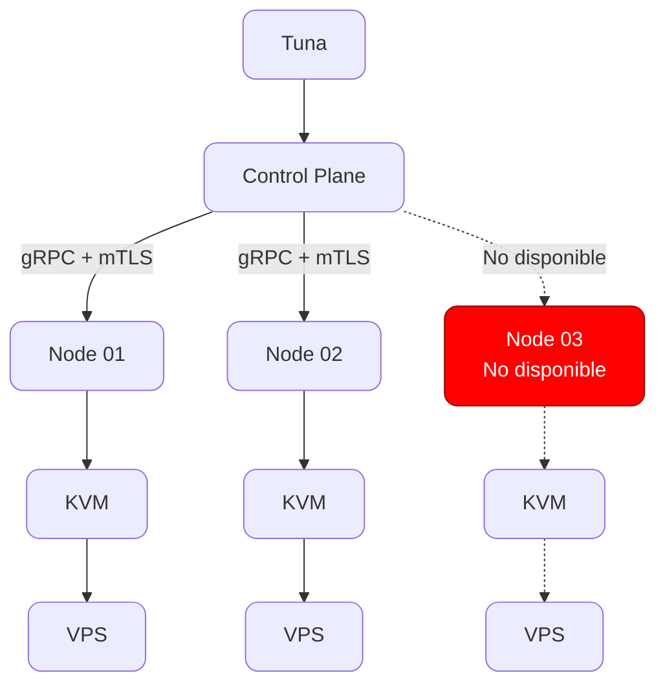

# ¿Qué es Tuna?

**Tuna** es la plataforma utilizada para la gestionar y operar nuestra infraestructura de servidores y máquinas virtuales.

Tuna proporciona una interfaz centralizada para administrar los recursos de computación, almacenamiento y red de la plataforma, permitiendo operar máquinas virtuales distribuidas entre diferentes servidores físicos.

## ¿Qué gestiona Tuna?

Tuna permite gestionar los principales recursos de nuestra infraestructura:

- Máquinas virtuales y VPS.
- CPU y memoria RAM.
- Almacenamiento.
- Imágenes de sistemas operativos.
- Redes virtuales.
- Servidores físicos.
- Nodos de infraestructura.
- Estado y disponibilidad de los recursos.
- Operaciones sobre las máquinas virtuales.

Desde el panel de Tuna se pueden realizar operaciones como crear, iniciar, detener, reiniciar y eliminar máquinas virtuales.

## Arquitectura

Tuna utiliza una arquitectura distribuida formada principalmente por un **Control Plane** y diferentes **Node Agents**.

El Control Plane actúa como componente central de la plataforma y mantiene el estado de la infraestructura.

Los Node Agents se ejecutan en los servidores físicos y son responsables de ejecutar las operaciones de virtualización y gestionar los recursos disponibles en cada nodo.

## Control Plane

El **Control Plane** es el núcleo de Tuna.

Centraliza la gestión de la infraestructura y coordina las operaciones que deben ejecutarse en los diferentes nodos.

Entre sus responsabilidades se encuentran:

- Gestionar máquinas virtuales.
- Mantener el estado de la infraestructura.
- Gestionar los nodos.
- Gestionar recursos.
- Coordinar operaciones.
- Proporcionar la API utilizada por el panel.
- Comunicarse con los Node Agents.

## Node Agent

El **Node Agent** es el componente que se ejecuta en cada servidor físico de la infraestructura.

Su función es actuar como intermediario entre el Control Plane y el hardware del nodo.

El Node Agent ejecuta las operaciones necesarias para administrar las máquinas virtuales y sus recursos.

Entre otras tecnologías, utiliza **KVM**, **QEMU** y **libvirt** para gestionar la virtualización.

## Infraestructura

Tuna está diseñada alrededor de una infraestructura compuesta por diferentes servidores físicos.

Cada servidor que forma parte de la plataforma funciona como un **Node** y dispone de un Node Agent.

Los recursos de estos nodos se utilizan para ejecutar las máquinas virtuales gestionadas por Tuna.

La incorporación de nuevos nodos permite ampliar la capacidad disponible de la plataforma.

## Propósito

Tuna existe para proporcionar una única plataforma desde la que podamos ofrecer a nuestros clientes el acceso a los recursos contratados

En lugar de gestionar cada servidor y cada máquina virtual de forma independiente, Tuna centraliza estas operaciones y proporciona una abstracción común sobre toda la infraestructura.

La plataforma está diseñada para evolucionar junto con nuestra infraestructura y adaptarse a las necesidades operativas de la misma.
